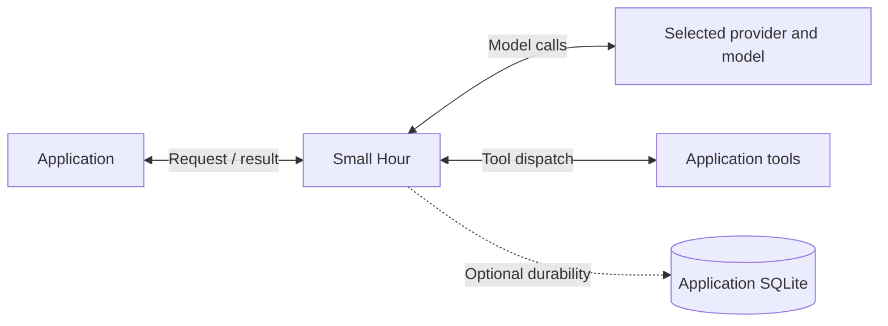

# Small Hour

Small Hour is a provider-neutral TypeScript runtime for application-defined LLM workflows, with tool execution, saved progress, spending controls, and recovery from failures.

It runs inside your application. You supply the request, instructions, relevant context, and tools or an output schema. Small Hour manages the model calls and execution checks, then returns a result and report. Your application decides what to save, show or deliver.

Read the [visual runtime guide](docs/runtime.md) for ownership, a complete tool exchange, and recovery after interrupted work.

## Capabilities

- Anthropic, OpenAI Responses, and OpenAI-compatible Chat Completions adapters.
- Fresh application-supplied instructions and memory on each turn.
- Ordered text and image input through Anthropic and OpenAI Responses.
- Sequential tools, per-turn allowlists, validated choices, and structured results.
- Bounded model calls, retries, deadlines, tokens, and tool results.
- Execution reports with accepted decisions, usage, tool outcomes, and receipt references.
- Optional correlated traces with explicit content capture and an application-supplied sink.
- Optional SQLite components for atomic local effects, model checkpoints, spending reservations, task execution, and saved-output delivery.

Version 0.6.0; the API is under development. Text, images, tools, and structured results are supported. Streaming and audio input are unavailable. Consumer integrations and live-model behavior require separate verification.

## Setup

Requires Node.js 26.10 or later and an ESM consumer. Install the built artifact using the [release and upgrade guide](docs/releases.md), or run `nvm use`, `npm ci` and `npm run build` in a source checkout. Package exports resolve to `dist`; `.nvmrc` selects the development and CI version.

1. Configure a [provider](docs/providers.md) with its model, endpoint, and credentials.
2. Construct `SmallHourRuntime` with `provider`, `persona`, and `memory`. `StaticPersonaSource` and `EmptyMemorySource` supply static instructions and empty context.
3. Register application functions through `ToolRegistry`; configure validation and execution limits.
4. Call `runtime.turn({ agentId, input, ... })`. Use `allowedTools` to narrow access or `structuredOutput: { schema, parse }` for a typed result.
5. Handle the result or `RuntimeError.report`. Add durable components when completed work must survive restart.

Import the core from `small-hour`; durable components are exported from `small-hour/durable/sqlite`. SQLite connections and drivers are supplied by the application.

## Integration requirements

Applications define workflows, facts, context selection, memory persistence, authorization, tools, output acceptance, pricing, transports, and interfaces. Configure current policies, stable identities, and evidence retention. Verify uncertain external effects before authorizing continuation.

Provider retries are owned by the runtime; SDK retries are disabled. The optional task runner owns claims and dispatch when selected. No automatic worker, polling loop, model server, or transport service starts on import.

## Reference

| Area | Contract |
| --- | --- |
| Runtime overview and ownership | [How a turn works](docs/runtime.md) |
| Pattern selection and validation ownership | [Architecture decisions](docs/architecture.md) |
| Turns, tools, choices, results | [Embedding](docs/embedding.md) |
| Limits, accounting, cancellation | [Execution](docs/execution.md) |
| Trace identity, content capture and destinations | [Tracing](docs/tracing.md) |
| Models and endpoints | [Providers](docs/providers.md) |
| Image selection, limits and storage | [Image input](docs/images.md) |
| Atomic local effects | [Local operations](docs/local-operations.md) |
| Saved model results | [Model steps](docs/model-steps.md) |
| Persistent budgets | [Model spending](docs/model-spending.md) |
| Claims and ordered steps | [Tasks](docs/tasks.md) |
| Saved-output handoff | [Delivery](docs/delivery.md) |
| Authorization and storage | [Security](docs/security.md) |
| Installation, compatibility and rollback | [Releases](docs/releases.md) |

Run `npm run check` for type checking, behavioral tests, and the build. `npm run check:package` verifies a clean installation of the packed artifact.
