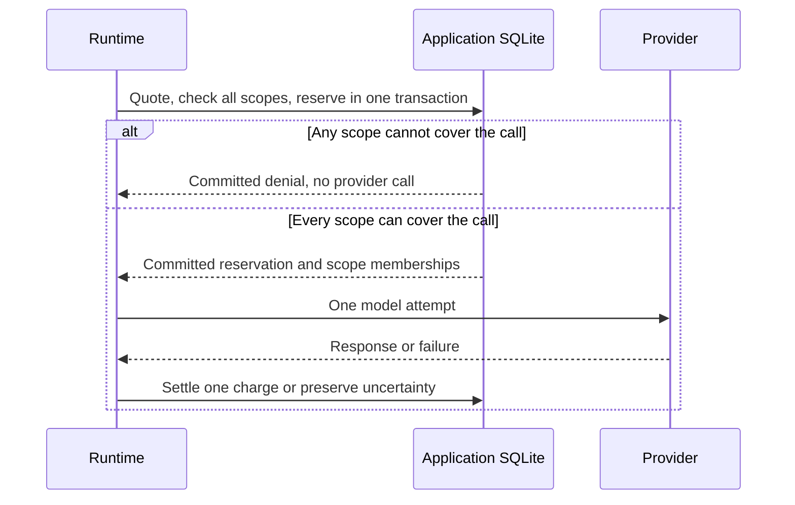
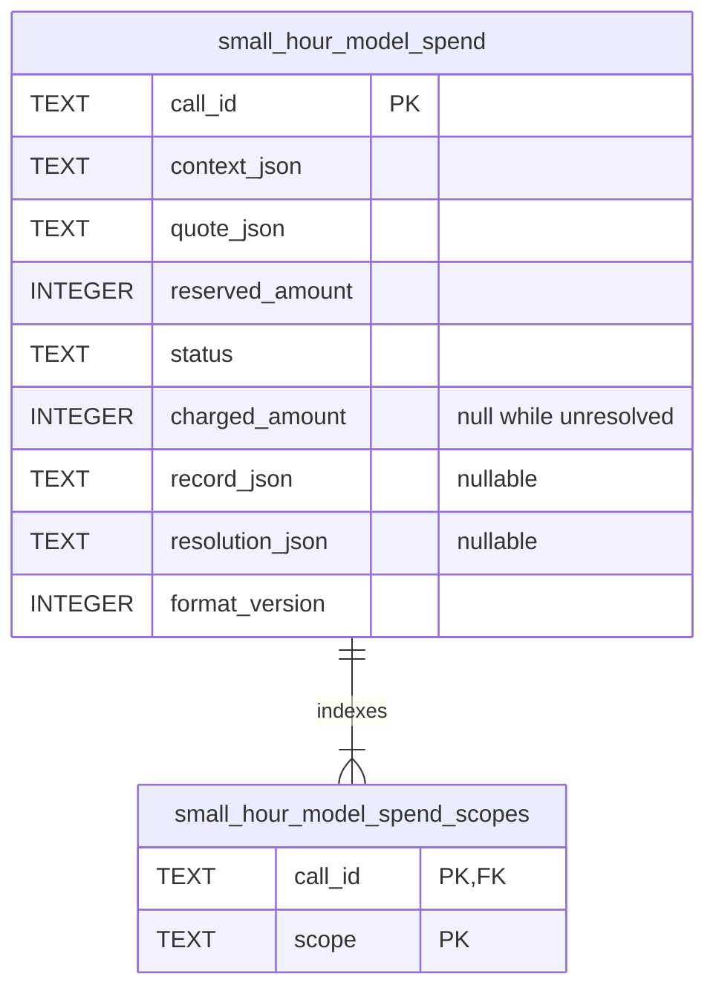

# Model spending

`SqliteModelSpendStore` supplies persistent admission and settlement through the runtime's `modelCalls` hooks. Import it from `small-hour/durable/sqlite`, provide a synchronous connection, and call `initialize()` outside an existing transaction. It creates or migrates the spending tables; see [upgrade requirements](releases.md#070).

## Policy

Set `modelCalls: store.hooks(policy)`. Both callbacks are synchronous and may read policy from the connection, but cannot open transactions or cause effects.

- `quote(context)` returns `{ scopes: [{ scope, limit }], amount, pricing }`, or the existing single-scope `{ scope, limit, amount, pricing }`. Context includes call/agent/turn IDs, provider/model, attempt, hop, explicit text/image input, and token limits. One `amount` reserves this attempt against every selected scope; each `limit` caps its complete scope. `pricing` is saved JSON.
- `charge(usage, pricing)` computes the charge from complete validated usage and saved pricing. Preserve pricing-version semantics and every billable token category.

Amounts are nonnegative safe integers in an application-defined unit. Quotes must conservatively cover input, output, reasoning, context, image processing, and tool results. Image byte limits are not token or cost estimates; selected memory is not included in the hook's explicit input. Underestimated charges are recorded in full, even above a limit, and restrict later admission. There is no built-in rate card, estimator, currency, or calendar.

Supply at least one unique scope; duplicate scopes, mixed quote forms and invalid limits fail before dispatch. A service allowance and an account allowance can both cover one call. All amounts use the same unit. Keep the selected scopes stable across retries and continuation steps; changed limits affect future admission without erasing prior costs. Authenticate scope selection. Calls made directly by tools or context loaders need separate admission. Avoid charging twice through `usage.record`.

## Admission and outcomes

Admission serializes in `BEGIN IMMEDIATE`, checks charges and unresolved reservations in every scope, and commits one reservation or denial. All scope memberships commit together; any write failure rolls back the decision. Only a newly committed reservation authorizes the provider. Reused call IDs throw `call_exists`; storage failure prevents dispatch.

| State | Budget treatment |
| --- | --- |
| `denied` | No provider authorization or charge. |
| `reserved` | Held while execution/accounting remains pending. |
| `accepted` | Known provider charge replaces the reservation; independent of output acceptance. |
| `rejected` | Definite evidence establishes no charge. |
| `unknown` | Lost response or missing usage retains the reservation. |

Refused, malformed, or application-rejected output can still incur cost. Accounting precedes tools and further calls. Every retry reserves under a new call ID against the same scope totals. Accounting failure stops continuation; cancellation may leave a reservation. Holds never expire automatically. Exact repeated accounting is a no-op; conflicting settlement fails.

## Inspection and reconciliation

`inspect(callId)` exposes identity, the original quote form, status, charge, provider record, and evidence. Narrow `quote.scopes` when reading the quote union. `inspectBudget(scope)` returns accepted, reserved, unknown, and total amounts, counting each call once in that scope. Do not sum overlapping budgets to calculate total spending; inspect a shared service scope or sum call records once. Obtain IDs from reports, checkpoints, or application queries. Saved accounting remains authoritative if a report still says `unrecorded`.

`reconcile(callId, outcome)` accepts `{ status: "accepted", amount, evidence }` or `{ status: "rejected", evidence }`. Evidence is a nonempty application-verified reference. Only reserved/unknown calls may change; exact repeats are safe, conflicting resolutions fail with `settlement_conflict`. Verify old execution cannot create a contradictory charge. Age or cancellation cannot establish non-execution. Reconciliation performs no provider call or workflow continuation.

Completed [model-step](model-steps.md) replay makes no reservation or charge. Incomplete steps still require their own reconciliation.

Admission, settlement, and reconciliation require independent transactions. No transaction spans a provider await. Stored data includes identities, limits, quotes, usage, and evidence; input/context content is not copied automatically. Initialization imports no historical charges. Preserve rows and one charging authority during adoption/rollback; deleting rows or changing scopes removes budget history. See [storage and access](security.md).

## Stored relationships

The call row owns the quote snapshot, monetary exposure and outcome. Scope rows are an indexed membership projection of that quote, written in the same transaction; they contain no separate charge or balance. Settlement updates only the call. Applications retain both tables together and enable SQLite foreign-key checks for database-level reference enforcement.

