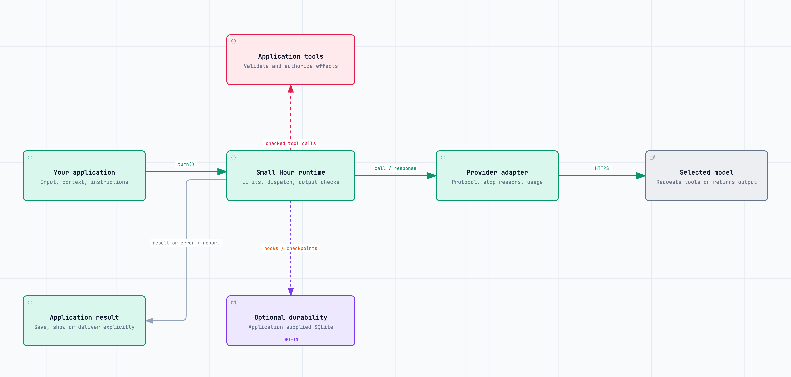
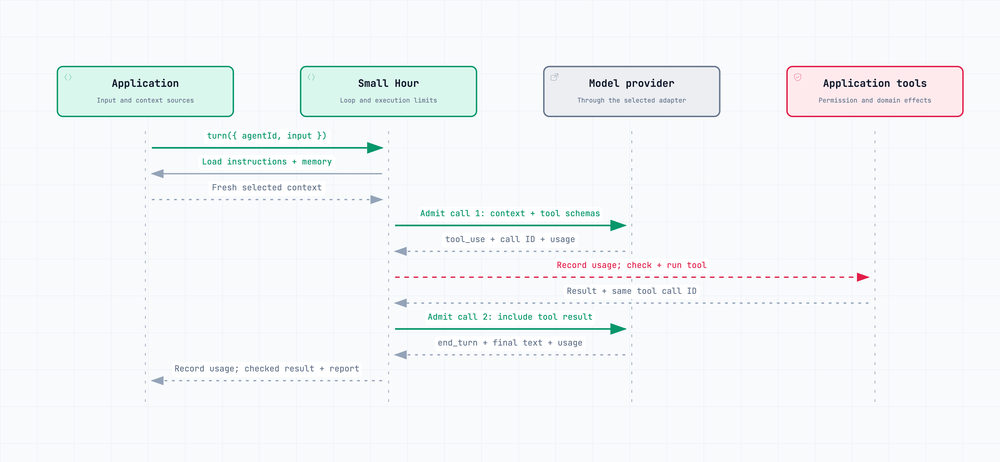
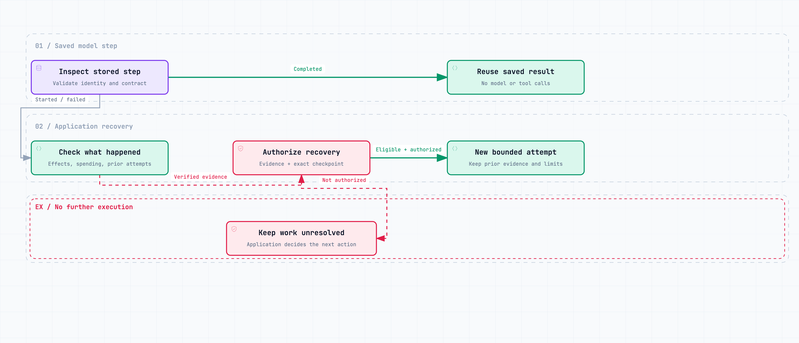

# How Small Hour works

Small Hour runs a bounded exchange between an application and a language model. A **turn** starts with one application request and can include several model calls. The core keeps no conversation history between turns.

## Who owns what

| Owner | Responsibility |
| --- | --- |
| Application | Defines workflows, selects facts and instructions, authorizes actions, implements tools, and decides what to save or show. |
| Model | Interprets supplied information, requests available tools, and generates a response or structured result. |
| Small Hour | Calls the provider, dispatches tools, enforces execution limits, applies configured checks, and reports outcomes and usage. |

A **provider adapter** translates this common contract into the selected service's format. Applications choose the provider and model; capabilities differ. A **tool** is an application function the model may request. The model cannot create tools or define its own workflow.

## One turn, step by step

1. The application calls `turn()`. Small Hour copies the input and loads fresh instructions and selected memory from application sources.
2. Small Hour checks remaining call capacity and runs any admission hook before contacting the provider. Optional spending hooks reserve the application's estimated cost.
3. A model response supplies content, a stop reason and available usage. Accounting runs before tools or another call. Only a `tool_use` stop permits tool dispatch.
4. Small Hour checks the tool allowlist and supplied argument parser, then executes tools sequentially. Each application tool enforces permission at its actual effect. Results return with the original tool call IDs for the next model call.
5. A valid final stop allows the output policy to check the response. The application receives the result and execution report, including calls, usage, tool outcomes, accepted choices and receipt references.

An optional **choice** contract preserves an accepted selection and can require it before writes. The application then authorizes each write against that selection. Schemas validate shape; they cannot establish permission or truth.

Alternatively, **structured output** requests data with a JSON schema and a required application parser. It permits one successful model response, with bounded transport retries, and no tools in that turn. The parser can use a library such as Zod. Invalid output does not trigger an automatic repair call.

## What happens when a limit is reached?

A **hop** is one pass through the model/tool loop. A failed provider request can be retried within that hop; each retry consumes another call. Small Hour owns these retries and disables SDK retries.

| Limit | Applies to | When it prevents continuation |
| --- | --- | --- |
| Deadline, hops and call count | The complete turn, including provider retries | No further model or tool work starts; the application receives an error and available report. |
| Output token allowance | Each provider call, including reasoning where specified by the provider | A truncated response fails acceptance. |
| Tool-result size | Each result sent back to the model | An oversized result fails unless the application supplies a bounded replacement. |
| Spending scope, when configured | All reservations and charges assigned to that scope | Admission denies the next call if its reservation would exceed the limit. |

A call count is not a money budget. Optional [spending controls](model-spending.md) use application-supplied prices and conservative estimates. Known charges are recorded even if an estimate was too low; uncertain calls keep their reservation until reconciled.

Tools need capacity for a following model call. A write that fails after starting stops the turn because its effect may already exist. Cancellation cannot undo completed effects or force a non-cooperative callback to stop. Read-tool errors can instead return to the model; an output policy can return a rejected result.

See [execution limits](execution.md) and [provider token semantics](providers.md) for defaults and exact behavior.

## Saved work and recovery

Durability is optional and uses the application's SQLite connection. A **checkpoint** saves progress so a later process can inspect it. **Replay** returns a committed result without repeating the work. **Reconciliation** means checking authoritative records to establish what actually happened.

[Local-operation receipts](local-operations.md) commit local database effects and results together. [Model-step checkpoints](model-steps.md) save explicit input, configuration, reports and completed results. They do not automatically copy retrieved memory or provider-native conversation history. Explicit image input is saved when model steps are selected.

Completed model steps replay without model or tool calls, preserving rejection as well as acceptance. Unfinished work is never automatically replayed. An initially eligible, tool-free step can receive an application-authorized recovery attempt against its exact inspected checkpoint. Attempt and call limits survive restart; spending requires its own settlement.

The optional [task runner](tasks.md) executes application-defined steps and [dispatches saved outputs](delivery.md) through application-supplied transports. Applications submit tasks, define eligibility and invoke the runner. No worker or polling loop starts on import.

## Finished, accepted, saved and delivered

| Outcome | Evidence |
| --- | --- |
| Model finished | A valid terminal provider response; it can still ask for clarification. |
| Output accepted | The configured output policy or parser accepted it. |
| Work saved | A committed application write or durable-store record. |
| Output delivered | Transport evidence; provider acceptance and device or user receipt remain distinct. |

The diagrams describe library responsibilities, not a deployment topology. Their [editable sources and export instructions](diagrams/README.md) live alongside the images.
