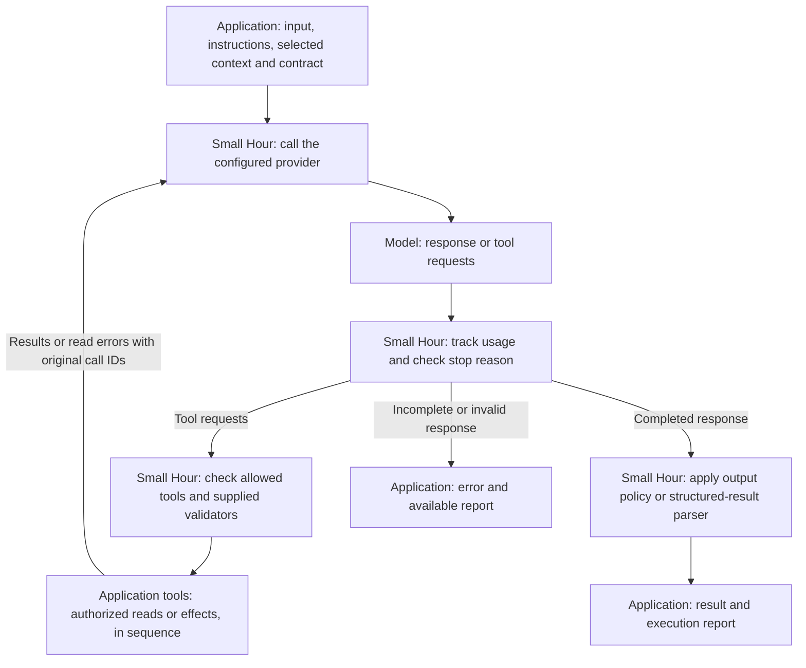

# How Small Hour runs a turn

Small Hour runs a bounded exchange between an application and a language model. The application calls it with a request and handles the result. A **turn** is one such execution; a turn can require several model calls.

## Who owns what

| Owner | Responsibility |
| --- | --- |
| Application | Defines the workflow, selects facts and instructions, authorizes actions, implements tools, and decides what to save or show. |
| Model | Interprets the supplied information, requests available tools, and generates a response or structured result. |
| Small Hour | Calls the provider, dispatches tools, enforces execution limits, applies configured checks, and reports outcomes and usage. |

A **provider adapter** translates the runtime's requests and responses into a particular model service's format. Applications choose the provider and model; supported capabilities differ.

## The execution loop

The application supplies the current input, instruction and memory sources, and registered tools. Each turn loads fresh instructions and selected context. The core keeps no history between turns. Alternatively, the application requests **structured output**: data matching a schema and an application parser, without tools.

Tools are application functions the model may request. The runtime restricts requests to the tools offered for that turn and runs supplied argument parsers before execution. Applications must supply domain validation and enforce permission at the actual effect. A schema alone does not grant permission.

A stopped turn throws an error with the available report. Read-tool errors can instead return to the model; an output policy can return a rejected result.

An optional **choice** contract preserves an accepted selection and can require it before writes. Subsequent writes then need application authorization against that selection.

A **hop** is one step around this loop; a failed provider request may be retried within it. Limits bound hops, provider attempts, time, per-call output allowance, and tool-result size. The runtime owns provider retries; they do not restart the whole turn. Tools require capacity for a following model call. A write that fails after starting stops the turn because its effect may already exist.

See [embedding](embedding.md), [execution limits](execution.md), and [providers](providers.md) for the enforcing contracts.

## Finished, accepted, saved, and delivered

These describe separate outcomes:

| Outcome | What establishes it |
| --- | --- |
| Model finished | A valid terminal provider response. This can still ask for clarification. |
| Output accepted | The configured output policy or structured-result parser accepted it. Application correctness still depends on those checks. |
| Work saved | A committed application write or optional durable-store record. A returned result alone is not persistence. |
| Output delivered | Evidence from the application's delivery system. Provider acceptance and device or user receipt are distinct. |

## Recovery is optional

[Local-operation receipts](local-operations.md) save a local database effect and its result together. **Replay** returns that committed result without repeating the effect. [Model-step checkpoints](model-steps.md) preserve completed results and available progress; completed replay skips model calls and tools.

Unfinished model work requires **reconciliation**: the application checks authoritative records to establish what happened and whether further action is safe. It is never automatically replayed. Saved records can include inputs, results, decisions, and receipt references; they do not automatically copy retrieved memory or retain a growing conversation.

Optional [spending controls](model-spending.md) reserve and settle model costs. The [task runner](tasks.md) executes application-defined steps and [dispatches saved outputs](delivery.md) through application-supplied transports. Applications submit tasks, define eligibility, and invoke execution. Importing Small Hour starts no worker or polling loop.
