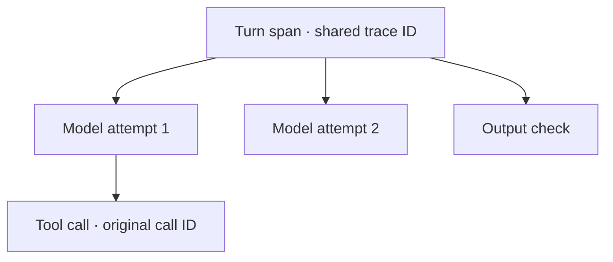

# Execution tracing

Tracing is optional. Small Hour emits records to an application-supplied sink; the application chooses storage, retention, access, redaction, dashboards and alerts. No collector, database or background exporter starts automatically.

## One trace, separate operations



A **trace ID** joins related work. A **span ID** identifies one operation within it. Retries receive separate model spans; existing provider request IDs, model-call IDs, tool-call IDs and receipt IDs remain available. Each record has a timestamp and a sequence number within its turn. Finish records include elapsed time.

```ts
const runtime = new SmallHourRuntime({
  provider,
  persona,
  memory,
  tracing: {
    sink: { record: event => traceBuffer.enqueue(event) },
    content: { maxBytes: captureLimitBytes },
  },
});

const result = await runtime.turn({
  agentId,
  input,
  trace: { traceId, parentSpanId },
});
```

`traceBuffer`, its capacity and flush behavior belong to the application. `record` must return synchronously and promptly. Omit `content` for metadata-only events. Enabling content requires an application-selected positive byte limit; there is no default content limit. Omit the turn's `trace` to generate an invocation trace. Supplied IDs use nonzero lowercase hexadecimal: 32 characters for `traceId`, 16 for `parentSpanId`.

## What is captured

Metadata includes identities, available model usage, normalized/native stop evidence, tool states and receipts, check verdicts, and the final runtime outcome. Error records use codes rather than exception messages. Metadata can still identify people through application-chosen IDs.

Content capture adds detached JSON snapshots of input, selected instructions/context, offered tools or output schema, responses, parsed tool arguments, tool results and final output. Model records distinguish the common runtime representation from the built-in adapter's effective request and decoded response. Transport headers and credentials are excluded. Custom providers can report native bodies through `ProviderRequest.trace`; otherwise only the runtime representation is available.

Tool results distinguish their original JSON representation from the serialized or compacted value supplied to the model. Native thinking blocks are retained when returned; they do not establish hidden reasoning or prove an effect occurred.

Every content field says `captured`, `omitted` or `unavailable`. Oversized values are omitted with their byte count and configured limit; they are never silently clipped. Serialization failures leave execution unchanged. Images count toward the byte limit, including their encoded bytes. Configure sufficient capacity or treat omitted evidence as incomplete.

Capture accepts plain JSON data. Proxies, accessors, custom serialization methods and non-JSON values are unavailable; tracing does not invoke application serialization code to inspect them.

## Failure and recovery

`result.trace` or `RuntimeError.report.trace` reports event count, export failures, content omissions and capture failures. Sink exceptions and unsupported promise returns cannot authorize work or trigger retries. Handoff counts do not prove persistence; the application owns export acknowledgements and shutdown flushing. A synchronous sink can consume execution time, so it must not perform slow work.

Application callbacks receive trace context. For correlation across workflow steps or recovery, persist and resupply the same trace ID. SQLite model steps retain trace metadata in their existing reports. Completed replay returns the original evidence without new provider/tool events; an authorized recovery invocation gets a new turn span. Trace IDs do not replace durable operation identities.

Capture settings apply to emitted events. Existing durable input/result storage keeps its own contract. Applications add context-selection and delivery evidence outside the runtime; a completed turn does not prove delivery. Required audit-before-effect policies need an explicit enforcement contract, separate from this observational sink.
